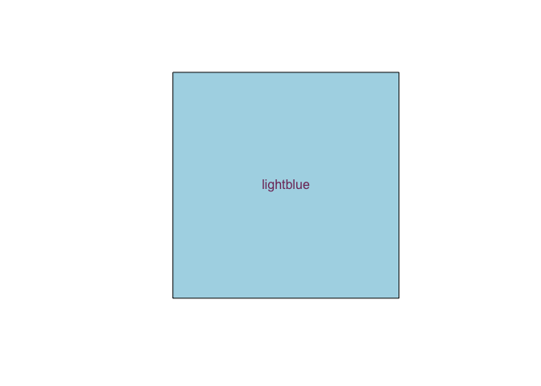

<!-- README.md is generated from README.Rmd. Please edit that file -->

# colorR

<!-- badges: start -->

[](https://github.com/marlfied/colorR/actions/workflows/R-CMD-check.yaml)
<!-- badges: end -->

The goal of colorR is to easily convert color formats (RGB to HEX and
vice versa, names of R-colors to RGB/HEX and vice versa). Additionally
to mix two colors and plot a given color.

## Installation

You can install the development version of colorR from
[GitHub](https://github.com/) with:

``` r
# install.packages("devtools")
devtools::install_github("marlfied/colorR")
```

or with:

``` r
remotes::install_github("marlfied/colorR")
```

## Example

This is a basic example which shows you how to solve a common problem:

``` r
library(colorR)

#get the HEX code of a color given in RGB format
rgb2hex(c(125,98,100))
#> [1] "#7d6264"

#plotting the color "lightblue"
show_colorR("lightblue", text_color="#7f3667")
```



``` r

#mixing "aquamarine2" and "#7f3667", result in HEX format
mix("aquamarine2", "#7f3667", as_HEX=TRUE)
#> [1] "#7b9297"
```
